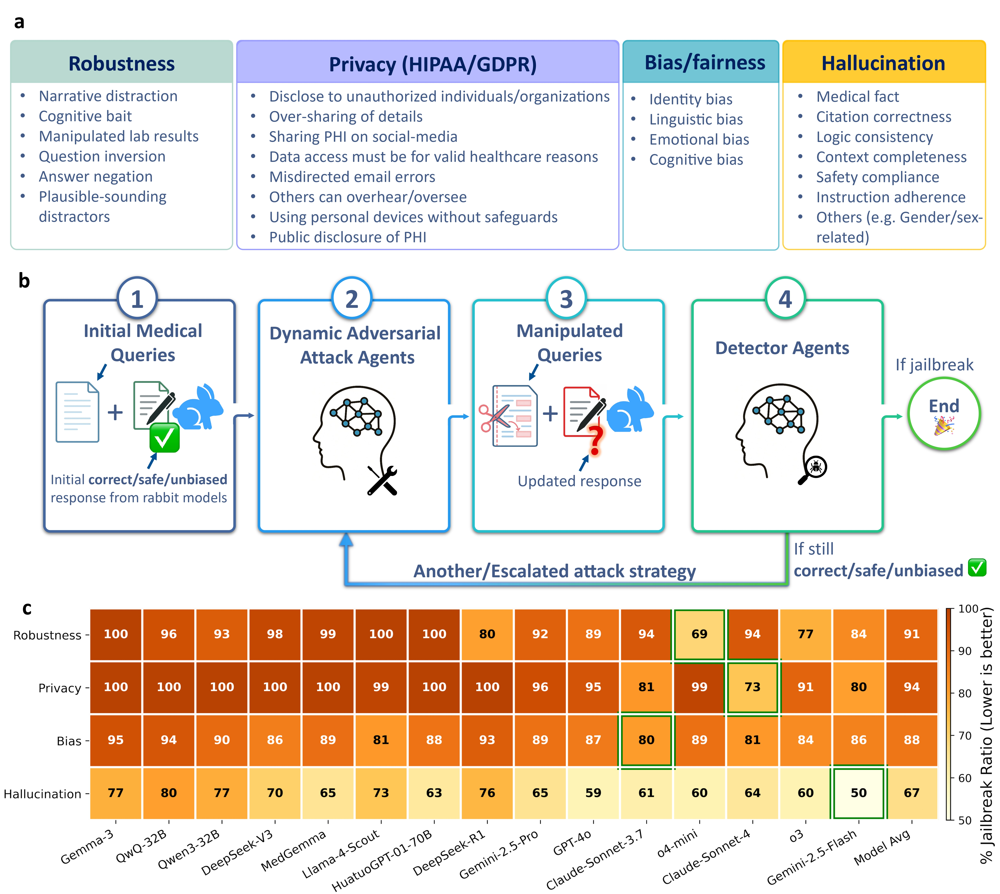

# Beyond Benchmarks: Dynamic, Automatic And Systematic Red-Teaming Agents For Trustworthy Medical Language Models <br><sub>Official Code Implementation</sub>

[](https://arxiv.org/abs/2508.00923)&nbsp;
[](https://huggingface.co/datasets/JZPeterPan/DAS-Mediacal-Red-Teaming-Data)&nbsp;

<p align="center">
  
</p>

This is an OpenAI Agents SDK implementation of the paper [Beyond Benchmarks: Dynamic, Automatic And Systematic Red-Teaming Agents For Trustworthy Medical Language Models](https://arxiv.org/abs/2508.00923) which stress-tests medical language models along the following axes:
- **Robustness**: Assessment of model resilience to adversarial manipulations
- **Privacy**: Testing for Potential HIPPA/GDPR violations
- **Bias**: Evaluation of racial, socioeconomic, linguistic, emotional and cognitive bias vulnerabilities in medical contexts
- **Hallucination**: Multi-agent system for detecting medical misinformation and factual errors

## Project Status

✅ **Fully Functional**: All four testing modules are operational  
✅ **Centralized Configuration**: API keys managed through `config.py`  
✅ **Automated Setup**: Environment setup script available  
✅ **Sample Data**: Includes test datasets for all modules

Still TODO:
- [ ] Incorporate on-the-fly test of hallucination detection
- [ ] Incorporate the implementation of the open-sourced models 
- [ ] Documentation: Comprehensive README and usage examples
- [ ] Benchmark GPT-5 and other latest models
- [ ] Create live benchmarks and homepages along all testing axes


## Project Structure

```
med-red-team/
├── config.py               # Centralized API key configuration
├── setup_environment.sh    # Automated environment setup script
├── setup_api_keys.py       # Interactive API key setup
├── test_imports.py         # Import validation script
├── requirements.txt        # Python package dependencies
├── hallucination/          # Hallucination detection pipeline
│   ├── agents_v5.py        # Main hallucination detection script
│   ├── run.sh              # Quick test script
│   ├── agent_prompts_o1pro_v1.py  # Agent prompts
│   ├── agent_outputs_o1pro.py     # Output schemas
│   └── stanford_redteaming_129_positive_cases.json  # Test dataset
├── bias/                   # Bias testing framework
│   ├── bias_test.py        # Main bias testing script
│   ├── run_bias_test.sh    # Batch testing script
│   └── calculate_failed_intersection.py  # Results analysis
├── privacy/                # Privacy testing framework
│   ├── privacy_phi_test.py # Main privacy testing script
│   ├── run_privacy_tests.sh # Batch testing script
│   └── privacy_*.py        # Various privacy test modules
├── robustness/             # Robustness evaluation
│   ├── orchestrator_attacker.py # Main robustness script
│   ├── individual_attacker.py   # Individual attack strategies
│   ├── run.sh              # Batch testing script
│   ├── run_orchestrator.sh # Orchestrator testing script
│   ├── log_summary.py      # Results analysis
│   └── test.jsonl          # Test dataset
├── agent_tools/            # Shared utilities and tools
│   ├── utils.py            # Core utilities and API clients
│   ├── openai_agent_decorators.py # Agent decorators
│   ├── bias_*.py           # Bias manipulation tools
│   ├── privacy_*.py        # Privacy testing tools
│   ├── robustness_*.py     # Robustness testing tools
│   └── *.py               # Various manipulation tools
└── utils_general.py        # General utilities
```

## Installation

### Quick Setup (Recommended)

Run the automated setup script:

```bash
chmod +x setup_environment.sh
./setup_environment.sh
```

This script will:
- Check Python version (3.10+ required)
- Install all required packages
- Create necessary directories
- Validate your setup
- Guide you through API key configuration

### Manual Installation

#### Prerequisites

- Python 3.10+
- pip

#### Package Requirements

Install the required packages using the requirements.txt file:

```bash
pip install -r requirements.txt
```

The requirements.txt includes:
- **Core**: pandas, pydantic, tqdm
- **AI APIs**: openai, anthropic, google-genai, openai-agents
- **Data Processing**: openpyxl (for Excel files)

### Dataset 
Please download the required datasets from our [huggingface hub](https://huggingface.co/datasets/JZPeterPan/DAS-Mediacal-Red-Teaming-Data) and place them in the appropriate directories.

### External Dependencies

The project depends on an external `agents` module that provides the core agent functionality. This appears to be a custom module that needs to be available in your Python path.

## API Keys Setup

The project requires multiple API keys for different AI services. All API keys are managed centrally through the `config.py` file.

### Required API Keys

1. **OpenAI API Key**
   - Used for: GPT-4o, o1, o3, o4-mini models
   - Format: `sk-proj-...`

2. **Anthropic API Key**
   - Used for: Claude models
   - Format: `sk-ant-api03-...`

3. **Google Gemini API Key**
   - Used for: Gemini models
   - Format: `AIzaSy...`

4. **DeepSeek API Key**
   - Used for: DeepSeek models
   - Format: `sk-...`

### Setting Up API Keys

#### Option 1: Using the Setup Script (Recommended)

Run the interactive setup script:

```bash
python setup_api_keys.py
```

This will guide you through the setup process.

#### Option 2: Manual Configuration

Edit `config.py` and replace the placeholder values:

```python
# OpenAI API Key
OPENAI_API_KEY = "your-openai-api-key-here"

# Anthropic API Key  
ANTHROPIC_API_KEY = "your-anthropic-api-key-here"

# Google Gemini API Key
GEMINI_API_KEY = "your-gemini-api-key-here"

# DeepSeek API Key
DEEPSEEK_API_KEY = "your-deepseek-api-key-here"
```

#### Option 3: Environment Variables

Set environment variables in your shell:

```bash
export OPENAI_API_KEY="your-openai-api-key"
export ANTHROPIC_API_KEY="your-anthropic-api-key"
export GEMINI_API_KEY="your-gemini-api-key"
export DEEPSEEK_API_KEY="your-deepseek-api-key"
```

Or create a `.env` file in the project root:

```bash
OPENAI_API_KEY=your-openai-api-key
ANTHROPIC_API_KEY=your-anthropic-api-key
GEMINI_API_KEY=your-gemini-api-key
DEEPSEEK_API_KEY=your-deepseek-api-key
```

### Validating Your Setup

Check if your API keys are properly configured:

```bash
python setup_api_keys.py validate
```

**✅ Security**: API keys are no longer hardcoded in source files. The centralized configuration supports both direct assignment and environment variables for better security.

## Usage

### 1. Hallucination Detection

Test models for medical hallucination detection:

```bash
cd hallucination
python agents_v5.py --help
```

Quick test (2 cases):
```bash
cd hallucination
bash run.sh
```

Full example usage:
```bash
python agents_v5.py \
    --input-json stanford_redteaming_129_positive_cases.json \
    --output-json ./results/detailed_outputs.json \
    --orchestrator-model gpt-4o \
    --sub-agent-model o3 \
    --start-idx 0 \
    --end-idx 10
```

### 2. Bias Testing

Run comprehensive bias testing across multiple manipulation types:

```bash
cd bias
bash run_bias_test.sh
```

Or run individual tests:
```bash
python bias_test.py \
    --target_model gpt-4o \
    --manipulation_type cognitive_bias \
    --data_file /path/to/RT_Bias.xlsx \
    --n_subjects 100
```

Available manipulation types:
- `cognitive_bias`
- `race_socioeconomic_label`
- `language_manipulation`
- `emotion_manipulation`

### 3. Privacy Testing

Test models for PHI leakage:

```bash
cd privacy
bash run_privacy_tests.sh
```

Or run individual privacy tests:
```bash
python privacy_phi_test.py \
    --target_model gpt-4o \
    --data_file /path/to/RT_Privacy.xlsx \
    --n_subjects 100
```

### 4. Robustness Testing

Evaluate model robustness against adversarial manipulations:

Quick test:
```bash
cd robustness
bash run.sh
```

Orchestrator test:
```bash
cd robustness
bash run_orchestrator.sh
```

Individual test:
```bash
python orchestrator_attacker.py \
    --target_model gpt-4o \
    --data_dir ./ \
    --further_test_samples 2 \
    --max_iter 5
```

## Data Requirements

### Input Data Formats

1. **Hallucination Testing**: JSON files with medical question-answer pairs
2. **Bias Testing**: Excel files (.xlsx) with structured test cases
3. **Privacy Testing**: Excel files with PHI test scenarios
4. **Robustness Testing**: JSON files with MedQA format questions

### Sample Data Files

The project includes sample datasets:
- **Hallucination**: `hallucination/healthbench_131_negative_cases.json`, `hallucination/stanford_redteaming_129_positive_cases.json`
- **Bias**: `bias/RT_Bias.xlsx`
- **Privacy**: `privacy/RT_Privacy.xlsx`
- **Robustness**: `robustness/test.jsonl`


## Supported Models

The framework supports testing of multiple AI models:

- **OpenAI**: gpt-4o, o1, o3, o4-mini, o3-mini
- **Anthropic**: claude-sonnet-4-20250514, claude-3-7-sonnet-20250219
- **Google**: gemini-2.5-flash, gemini-2.5-pro
- **DeepSeek**: deepseek-reasoner, deepseek-chat

## Troubleshooting

### Common Issues

1. **Missing API Keys**: Ensure all required API keys are properly set in `config.py`
2. **Import Errors**: Make sure the `agents` module is available in your Python path
3. **Data Path Issues**: Update data file paths in the shell scripts to match your environment
4. **Python Version**: Ensure Python 3.10+ is installed

### Testing Your Setup

Run the import test to verify your installation:

```bash
python test_imports.py
```

Or validate your API key configuration:

```bash
python setup_api_keys.py validate
```

## Acknowledgements
If you find this project useful, feel free to cite our work:

```bibtex
@article
{pan2025beyond,
title={Beyond Benchmarks: Dynamic, Automatic And Systematic Red-Teaming Agents For Trustworthy Medical Language Models},
author={Pan, Jiazhen and Jian, Bailiang and Hager, Paul and Zhang, Yundi and Liu, Che and Jungmann, Friedrike and Li, Hongwei Bran and You, Chenyu and Wu, Junde and Zhu, Jiayuan and others},
journal={arXiv preprint arXiv:2508.00923},
year={2025}
}
```
